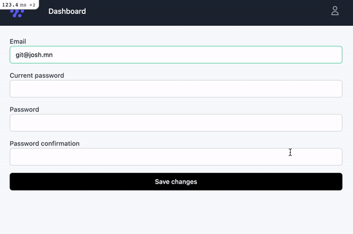

#  HotFlash

Automagically inject flash messages into Ruby on Rails TurboStream responses using [Hotwire](https://github.com/hotwired/turbo-rails).



## Why

Because it's weird? I don't know.

I originally developed [TurboFlash](https://github.com/joshmn/turbo_flash) as a proof of concept, but people ended up using it, and, even scarier, contributing back to it. This terrified me because...

I truthfully hate the implementation. It felt like one big hack. I knew a better way to do it. So, here it is, in all its glory, "better", but I still don't like it.

Granted, this implementation is arguably just as "bad" because it intercepts `render`, but it's clean, _should_ be relatively safe, and works.

## How it works 

HotFlash is about 100 lines of code, mostly of convenience methods and developer happiness code. It's not scary. This code effectively does the following, so you don't have to:

```ruby
def create
  @post = Post.new(post_params)
  if @post.save 
    redirect_to @post 
  else
    render turbo_stream: [
      turbo_stream.replace(:form, "form", locals: { post: @post }),
      turbo_stream.replace(:flashes, "shared/flashes") # <-- this 
    ]
  end
end
```

## Usage

1. Add it to your application:

```shell 
bundle add hot_flash
```

2. Install it 

```shell 
rails g hot_flash:install
```

Will copy over an initializer. 

3. Make it work with your application

It's not enabled out-of-the-box, so you'll need to enable it:

```ruby
class ApplicationController < ActionController::Base
  before_action :enable_hotflash
end
```

HotFlashes expects you to have a target of `#flashes` available, and a method called `#render_flash` available as a helper.

```ruby
module ApplicationHelper
  def render_flash
    return if @_flash_rendered
    
    render partial: "shared/flash"
  end
end
```

Where `app/views/shared/flash.html.erb` renders the flash contents and includes the target selector:

```html
<div id="flashes">
  <% flash.each do |key, value| %>
    <div><%= key %>: <%= value %></div>
  <% end %> 
</div>
```

4. Get on with your day because you're done

All flashes are rendered just like they would be in the default request/response cycle; no need to do any of the hack-y junk that TurboFlash did.

5. But you can get more granular:

### Disable or enable:

```ruby
class PostsController < ApplicationController
  disable_hotflash
end
```

or,

```ruby
class PostsController < ApplicationController
  disable_hotflash only: [:new]
end
```

or,

```ruby
class PostsController < ApplicationController
  enable_hotflash only: [:new]
end
```

### Fiddle with HotFlashes on yourself

HotFlashes has a `hotflash` method that you can interact with if you want:

```ruby
class PostsController < ApplicationController
  before_action :disable_hotflash
  before_action :interact_with_hotflash
  
  private 
  
  def interact_with_hotflash
    hotflash.enable!
    hotflash.turbo_action = "update"
    hotflash.flash_message = :some_other_way_to_show_the_message
    hotflash.turbo_target = '#some_other_target'
  end
end
```

## Contributing

`flash_method` could probably use some options.

## License

The gem is available as open source under the terms of the [MIT License](https://opensource.org/licenses/MIT).
